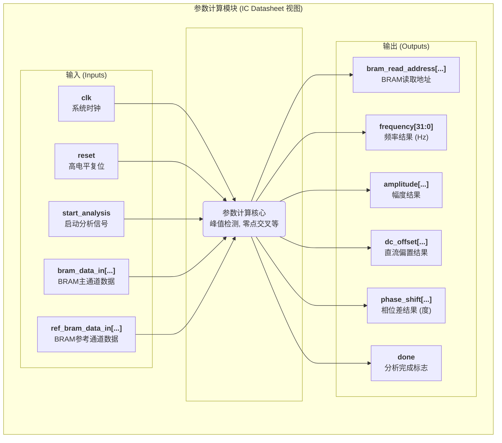

# THD模块
## 大致实现

## 交互协议

1.  **复位**: 在系统启动时, 将 **reset** 信号置为高电平至少一个时钟周期以初始化模块。
2.  **启动**: 在 **start\_analysis** 端口上发送一个单周期的启动脉冲, 命令模块开始新一轮的参数计算。
3.  **运行**: 模块启动后, 它会自动控制 **bram\_read\_address** 来扫描整个BRAM中的波形数据。这个过程是自动的, 无需外部干预。
4.  **等待完成**: 持续监视 **done** 信号。模块完成所有计算后, 会将此信号拉高一个时钟周期。
5.  **读取结果**: 当 **done** 信号为高电平时, 在该时钟周期从 `frequency`, `amplitude`, `dc_offset`, 和 `phase_shift` 端口上读取有效的计算结果。

-----

## 模块框图

