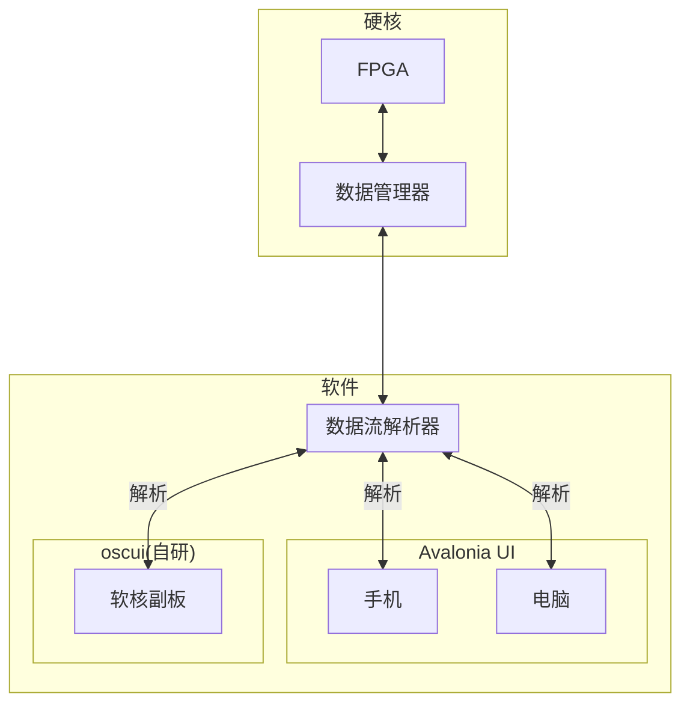

# UI架构
## 目标
以FPGA发送的[统一数据流](./UI接口设定.md#数据流定义)为统一IO接口,设计设计t一套完全数据驱动的,MVVM架构的UI.

使用方式:
- 连接ESP32模块(Type-C),可以直接在ESP32板附带的屏幕上进行交互,同时可用手机通过蓝牙连接,使用监控app进行监控
- 拔掉ESP32模块直接连接电脑,可以当作虚拟示波器使用

## 软件架构

```mermaid
graph TD

subgraph Hardcore[硬核]
    FPGA[FPGA] <-->
    DataMgr[数据管理器]
end

subgraph Software[软件]
    subgraph Avl[Avalonia UI]
    Phone[手机]
    PC[电脑]
    end
    subgraph GL["oscui(自研)"]
        Emb[软核副板]
    end
    subgraph Parser[数据流解析器]

    end
end

DataMgr <---> Parser <--解析--> Phone & PC & Emb
```