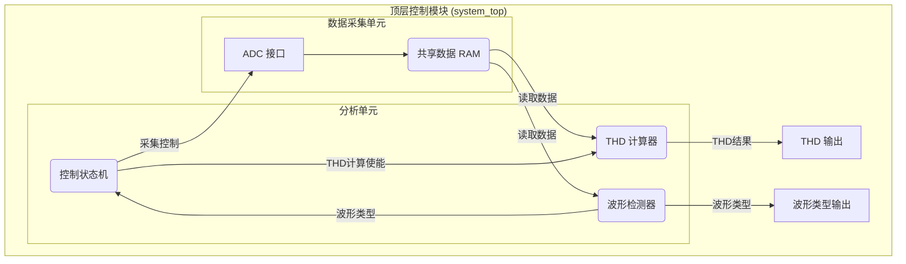

# 信号分析模块

```mermaid
graph TD
subgraph "顶层控制模块 (system_top)"
    direction LR
    
    subgraph "数据采集单元"
        ADC[ADC 接口] --> RAM(共享数据 RAM)
    end

    subgraph "分析单元"
        Controller(控制状态机)

        Detector(波形检测器)
        
        THD(THD 计算器)

        RAM -- "读取数据" --> Detector
        RAM -- "读取数据" --> THD
        
        Detector -- "波形类型" --> Controller
        Controller -- "THD计算使能" --> THD
    end

    Controller -- "采集控制" --> ADC
    THD -- "THD结果" --> Result_THD[THD 输出]
    Detector -- "波形类型" --> Result_Shape[波形类型输出]

end
```