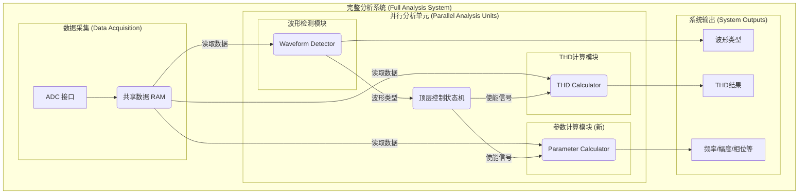

# 分析系统框图

```mermaid
graph TD
subgraph "完整分析系统 (Full Analysis System)"
    direction LR
    
    subgraph "数据采集 (Data Acquisition)"
        ADC[ADC 接口] --> RAM(共享数据 RAM)
    end

    subgraph "并行分析单元 (Parallel Analysis Units)"
        Controller(顶层控制状态机)
        
        subgraph "波形检测模块"
            Detector(Waveform Detector)
        end
        
        subgraph "THD计算模块"
            THD(THD Calculator)
        end

        subgraph "参数计算模块 (新)"
            Params(Parameter Calculator)
        end

        RAM -- "读取数据" --> Detector
        RAM -- "读取数据" --> THD
        RAM -- "读取数据" --> Params
        
        Detector -- "波形类型" --> Controller
        Controller -- "使能信号" --> THD
        Controller -- "使能信号" --> Params
    end

    subgraph "系统输出 (System Outputs)"
        direction TB
        Out1[波形类型]
        Out2[THD结果]
        Out3["频率/幅度/相位等"]
    end

    Detector --> Out1
    THD --> Out2
    Params --> Out3
end
```