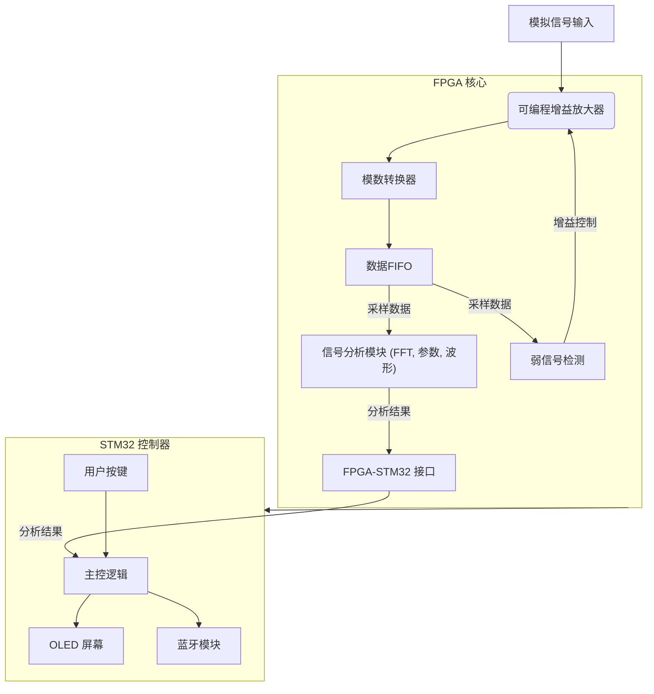
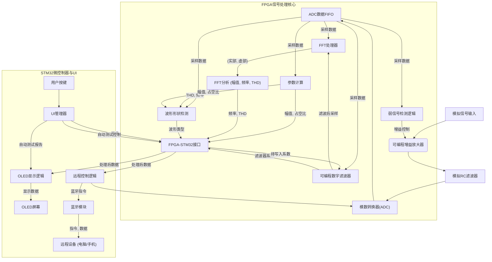

# 架构图
## 大致架构

```mermaid
graph TD
    A["模拟信号输入"] --> PGA("可编程增益放大器");
    PGA --> ADC["模数转换器"];

    subgraph FPGA ["FPGA 核心"]
        ADC --> FIFO["数据FIFO"];
        
        FIFO -- "采样数据" --> Analysis_Module["信号分析模块 (FFT, 参数, 波形)"];
        FIFO -- "采样数据" --> Weak_Signal_Detect["弱信号检测"];

        Weak_Signal_Detect -- "增益控制" --> PGA;
        Analysis_Module -- "分析结果" --> Interface["FPGA-STM32 接口"];
    end

    subgraph STM32 ["STM32 控制器"]
        Interface -- "分析结果" --> Core_Logic["主控逻辑"];
        
        Buttons["用户按键"] --> Core_Logic;
        Core_Logic --> OLED["OLED 屏幕"];
        Core_Logic --> BT["蓝牙模块"];
    end

    FPGA --> STM32;
```
## 完整架构

```mermaid
flowchart TD
 subgraph FPGA_System["FPGA信号处理核心"]
    direction LR
        ADC_FIFO["ADC数据FIFO"]
        ADC["模数转换器(ADC)"]
        Weak_Sig_Det_Analysis["弱信号检测逻辑"]
        FFT_Proc["FFT处理器"]
        Waveform_Det["波形形状检测"]
        Param_Calc["参数计算"]
        Filter_Prog["可编程数字滤波器"]
        FFT_Analysis["FFT分析 (幅值, 频率, THD)"]
        PGA("可编程增益放大器")
        Interface["FPGA-STM32接口"]
  end
 subgraph STM32_Controller["STM32微控制器与UI"]
    direction LR
        Display_Logic["OLED显示逻辑"]
        Remote_Control_Logic["远程控制逻辑"]
        UI_Manager["UI管理器"]
        User_Input["用户按键"]
        OLED["OLED屏幕"]
        Bluetooth_Module["蓝牙模块"]
        Remote_Device["远程设备 (电脑/手机)"]
  end
    A["模拟信号输入"] --> PGA
    PGA --> R_C_Filter["模拟RC滤波器"]
    R_C_Filter --> ADC
    ADC --> ADC_FIFO
    ADC_FIFO -- 采样数据 --> Weak_Sig_Det_Analysis & FFT_Proc & Waveform_Det & Param_Calc & Filter_Prog
    Filter_Prog -- 滤波后采样 --> FFT_Proc
    FFT_Proc -- (实部, 虚部) --> FFT_Analysis
    FFT_Analysis -- THD, 频率 --> Waveform_Det
    Param_Calc -- 幅值, 占空比 --> Waveform_Det & Interface
    Weak_Sig_Det_Analysis -- 增益控制 --> PGA
    FFT_Analysis -- 频率, THD --> Interface
    Waveform_Det -- 波形类型 --> Interface
    Filter_Prog -- 滤波器系数 --> Interface
    Interface -- 处理后数据 --> Display_Logic & Remote_Control_Logic
    Interface -- 待写入系数 --> Filter_Prog
    User_Input --> UI_Manager
    UI_Manager -- 指令 --> Interface
    Display_Logic -- 显示数据 --> OLED
    Remote_Control_Logic -- 蓝牙指令 --> Bluetooth_Module
    Bluetooth_Module -- 指令, 数据 --> Remote_Device
    UI_Manager -- 自动测试报告 --> Display_Logic
    UI_Manager -- 自动测试控制 --> Interface
    FPGA_System ~~~ STM32_Controller
    Remote_Control_Logic --> ADC

```