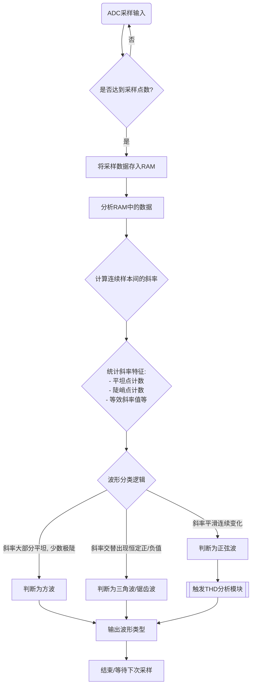
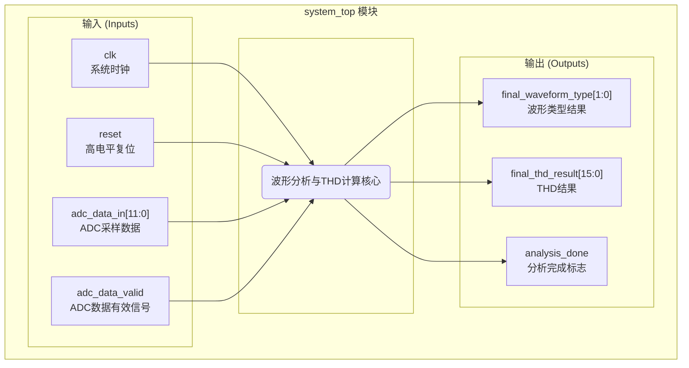

# 波形检测
## 大致流程

```mermaid
graph TD
    B(ADC采样输入) --> C{是否达到采样点数?}
    C -- 否 --> B
    C -- 是 --> D[将采样数据存入RAM]
    D --> E[分析RAM中的数据]
    E --> F{计算连续样本间的斜率}
    F --> G{统计斜率特征: <br> - 平坦点计数<br> - 陡峭点计数<br> - 等效斜率值等}
    G --> H{波形分类逻辑}
    H -- 斜率大部分平坦, 少数极陡 --> I[判断为方波]
    H -- 斜率交替出现恒定正/负值 --> J[判断为三角波/锯齿波]
    H -- 斜率平滑连续变化 --> K[判断为正弦波]
    I --> L[输出波形类型]
    J --> L
    K --> M[[触发THD分析模块]]
    M --> L
    L --> N[结束/等待下次采样]
```
## 模块框图

```mermaid
graph TD
subgraph "system_top 模块"
direction LR

    subgraph  
        Logic(波形分析与THD计算核心)
    end

    subgraph "输入 (Inputs)"
        clk["clk<br/>系统时钟"] --> Logic
        reset["reset<br/>高电平复位"] --> Logic
        adc_data_in["adc_data_in[11:0]<br/>ADC采样数据"] --> Logic
        adc_data_valid["adc_data_valid<br/>ADC数据有效信号"] --> Logic
    end

    
    
    subgraph "输出 (Outputs)"
        Logic --> final_waveform_type["final_waveform_type[1:0]<br/>波形类型结果"]
        Logic --> final_thd_result["final_thd_result[15:0]<br/>THD结果"]
        Logic --> analysis_done["analysis_done<br/>分析完成标志"]
    end
end
```