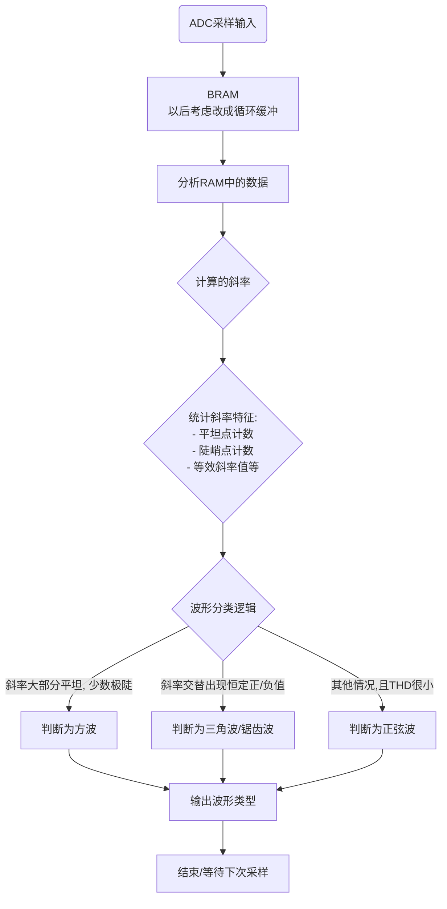
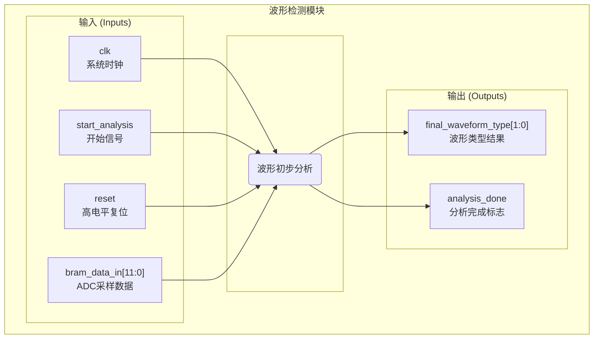

# 波形检测
## 大致流程

## 交互协议

1.  **复位**: 将 `reset` 信号置为高电平至少一个时钟周期以初始化模块。
2.  **启动**: 在 `start_analysis` 端口上发送一个单周期的启动脉冲, 命令模块开始新一轮的波形分类。
3.  **读取结果**: 当 `done` 信号为高电平时, 在该时钟周期从 `waveform_type` 端口上读取有效的分类结果。

## 模块框图
